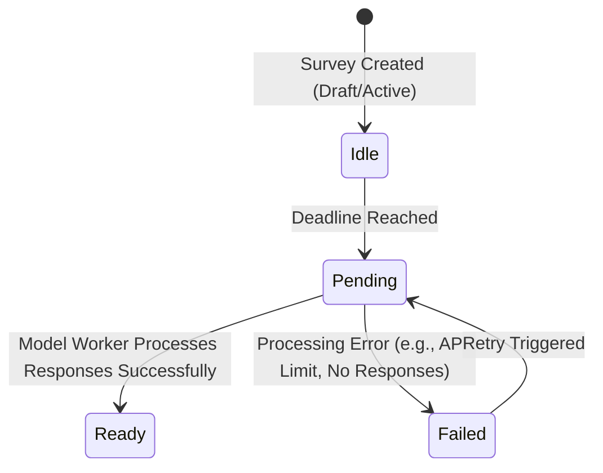
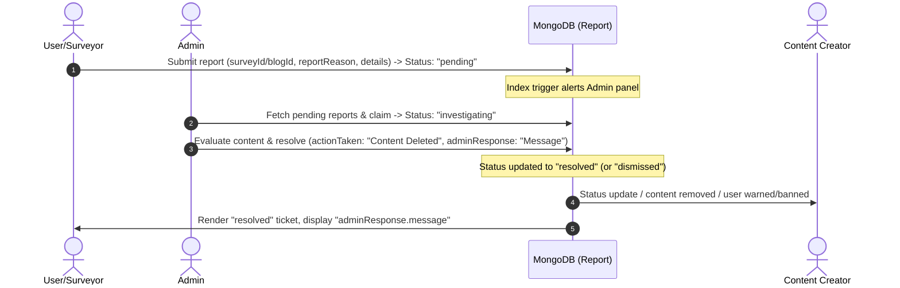
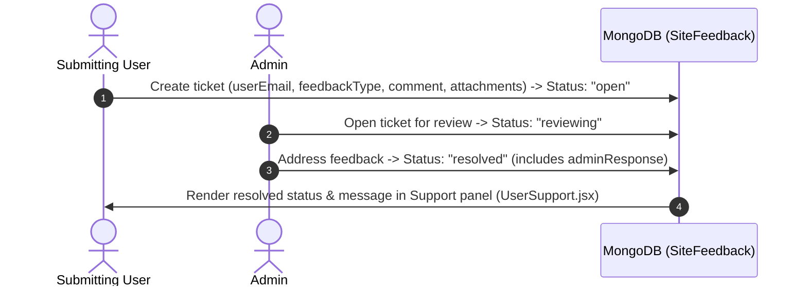

# Survey Hub — Core Architecture & Feature Matrix

This document defines the system architecture, code correspondence, role boundaries, and state-machine lifecycles for the **Survey Hub** MERN SaaS platform.

---

## 1. Feature Map & Code Correspondence

The table below maps the core system features of Survey Hub to their respective backend database models and frontend components/views.

| Feature Category | Key System Capabilities | Backend Models | Frontend Components & Views |
| :--- | :--- | :--- | :--- |
| **Surveys Framework** | Dynamic multi-question builder, linear scales, MCQs, checkboxes, publishing workflows, responses collection, and duration metrics. | - [Survey.js](file:///f:/Job%20stuff/Projects/SurveyHub/backend/models/Survey.js)<br>- [response.js](file:///f:/Job%20stuff/Projects/SurveyHub/backend/models/response.js) | - [CreateSurvey.jsx](file:///f:/Job%20stuff/Projects/SurveyHub/frontend/src/Pages/Dashboard/Surveyor/Components/CreateSurvey.jsx)<br>- [MySurveys.jsx](file:///f:/Job%20stuff/Projects/SurveyHub/frontend/src/Pages/Dashboard/Surveyor/Components/MySurveys.jsx)<br>- [SurveyDetailPage.jsx](file:///f:/Job%20stuff/Projects/SurveyHub/frontend/src/Pages/Surveys/SurveyDetailPage.jsx)<br>- [SurveyResults.jsx](file:///f:/Job%20stuff/Projects/SurveyHub/frontend/src/Pages/Surveys/SurveyResults.jsx)<br>- [SurveysPage.jsx](file:///f:/Job%20stuff/Projects/SurveyHub/frontend/src/Pages/Surveys/SurveysPage.jsx)<br>- [ParticipationLedger.jsx](file:///f:/Job%20stuff/Projects/SurveyHub/frontend/src/Pages/Dashboard/User/Components/ParticipationLedger.jsx) |
| **System Moderation & Compliance** | User content flagging, reporting of surveys/blogs/comments, admin investigation panels, site feedback, and support ticketing. | - [report.js](file:///f:/Job%20stuff/Projects/SurveyHub/backend/models/report.js)<br>- [siteFeedback.js](file:///f:/Job%20stuff/Projects/SurveyHub/backend/models/siteFeedback.js) | - [AdminModeration.jsx](file:///f:/Job%20stuff/Projects/SurveyHub/frontend/src/Pages/Dashboard/Admin/Components/AdminModeration.jsx)<br>- [AdminReports.jsx](file:///f:/Job%20stuff/Projects/SurveyHub/frontend/src/Pages/Dashboard/Admin/Components/AdminReports.jsx)<br>- [FeedbackManagement.jsx](file:///f:/Job%20stuff/Projects/SurveyHub/frontend/src/Pages/Dashboard/Admin/Components/FeedbackManagement.jsx)<br>- [ReportSidePanel.jsx](file:///f:/Job%20stuff/Projects/SurveyHub/frontend/src/Pages/Dashboard/Admin/FeedbackSidePanel.jsx)<br>- [FeedbackSidePanel.jsx](file:///f:/Job%20stuff/Projects/SurveyHub/frontend/src/Pages/Dashboard/Admin/FeedbackSidePanel.jsx)<br>- [ContentReviewModal.jsx](file:///f:/Job%20stuff/Projects/SurveyHub/frontend/src/Pages/Dashboard/Admin/Components/ContentReviewModal.jsx)<br>- [UserReports.jsx](file:///f:/Job%20stuff/Projects/SurveyHub/frontend/src/Pages/Dashboard/User/Components/UserReports.jsx)<br>- [UserSupport.jsx](file:///f:/Job%20stuff/Projects/SurveyHub/frontend/src/Pages/Dashboard/User/Components/UserSupport.jsx) |
| **Community Engine** | Blog publishing, markdown rendering, nested comment trees, user reactions (like, insightful, funny, etc.), and activity tracking. | - [Blog.js](file:///f:/Job%20stuff/Projects/SurveyHub/backend/models/Blog.js)<br>- [Activity.js](file:///f:/Job%20stuff/Projects/SurveyHub/backend/models/Activity.js) | - [BlogsPage.jsx](file:///f:/Job%20stuff/Projects/SurveyHub/frontend/src/Pages/Blogs/BlogsPage.jsx)<br>- [BlogDetailPage.jsx](file:///f:/Job%20stuff/Projects/SurveyHub/frontend/src/Pages/Blogs/BlogDetailPage.jsx)<br>- [BlogCards.jsx](file:///f:/Job%20stuff/Projects/SurveyHub/frontend/src/Pages/Blogs/BlogCards.jsx)<br>- [BlogCommentReply.jsx](file:///f:/Job%20stuff/Projects/SurveyHub/frontend/src/Pages/Blogs/BlogCommentReply.jsx)<br>- [CreateBlog.jsx](file:///f:/Job%20stuff/Projects/SurveyHub/frontend/src/Pages/Dashboard/Surveyor/Components/CreateBlog.jsx)<br>- [BlogStudio.jsx](file:///f:/Job%20stuff/Projects/SurveyHub/frontend/src/Pages/Dashboard/Surveyor/Components/BlogStudio.jsx) |
| **Monetization Ledger** | Stripe payment webhook handlers, subscriptions, credit wallets, transaction history, and real-time balance calculations. | - [Subscription.js](file:///f:/Job%20stuff/Projects/SurveyHub/backend/models/Subscription.js)<br>- [User.js](file:///f:/Job%20stuff/Projects/SurveyHub/backend/models/User.js) | - [PricingPage.jsx](file:///f:/Job%20stuff/Projects/SurveyHub/frontend/src/Pages/Payment/PricingPage.jsx)<br>- [PaymentSuccessPage.jsx](file:///f:/Job%20stuff/Projects/SurveyHub/frontend/src/Pages/Payment/PaymentSuccessPage.jsx)<br>- [ProfileSettings.jsx](file:///f:/Job%20stuff/Projects/SurveyHub/frontend/src/Pages/Dashboard/Shared/ProfileSettings.jsx) |

---

## 2. Explicit Feature Roadmap & Constraints

### A. AI Analytics on Surveys (Post-Expiration Analysis)

To maximize the value of survey results, an automated worker processes response data once a survey reaches its expiration deadline.



1. **Trigger Condition:** A scheduled system cron checks for surveys where the `deadline` timestamp is less than `Date.now()` and `aiInsight.status` is `'idle'`.
2. **Transition to `pending`:** The system marks `aiInsight.status` as `'pending'` to lock the record, preventing redundant model worker invocations.
3. **Data Aggregation:** The worker queries the `Response` model matching the `surveyId`, fetching all submitted response records. It aggregates selection counts for MCQs, checkboxes, and linear scales.
4. **LLM Processing (Gemini):** Text answers from paragraph/short-answer fields are batch-passed to the Gemini model worker. The prompt requests:
   - Sentiment evaluation.
   - Core thematic clusters (Top Themes).
   - Executive summary.
   - Critical recommendations and actionable findings.
5. **State Update (`ready` / `failed`):**
   - On success, findings are stored in the `aiInsight` sub-document (`summary`, `keyFindings`, `recommendations`, `stats.perQuestion`), and `aiInsight.status` transitions to `'ready'`.
   - On failure, `aiInsight.status` is set to `'failed'` to allow automatic or manual retry.

---

### B. Auto-Credit Renewal Sync

Surveyors' wallets are periodically refreshed based on their Stripe billing cycle to support continuous usage patterns.

- **Billing Check Agent:** A background worker runs at scheduled intervals (e.g., daily) checking active users.
- **Interval Syncing:** The agent inspects `User.js` -> `subscription.currentPeriodEnd` and compares it against the last sync timestamp.
- **Ledger Injections:** If a new billing period has commenced and Stripe confirms payment receipt (`subscription.status` is `'active'`), the system:
  1. Locates the user's wallet in `Subscription.js`.
  2. Injects the package-specific credit allotment (e.g., +100 credits).
  3. Writes a ledger entry of type `'purchase'` or `'bonus'` to `creditLedger` (with a description like `"Monthly subscription credit renewal"`).
  4. Recalculates and saves the updated `balance`.

---

### C. Transactional Credit Cuts on Publish

To maintain platform monetization, survey publication and premium blogging consume credits from the Surveyor's wallet. This operation requires strict ACID transactions.

> [!IMPORTANT]
> **Wallet Constraints & Publishing Costs**
>
> - **Survey Publication:** Costs **5 credits**.
> - **Premium Blog Publication:** Costs **2 credits**.
> - Any attempt to publish with insufficient credits is strictly blocked.

```
                  Publish Requested
                         │
                         ▼
             ┌───────────────────────┐
             │   Start Mongoose      │
             │    Session & Tx       │
             └───────────┬───────────┘
                         │
                         ▼
             ┌───────────────────────┐
             │ Query Subscription    │
             │ Balance (with write   │
             │ lock/isolation)       │
             └───────────┬───────────┘
                         │
               Is Balance Sufficient?
                   /           \
                 Yes            No
                 /                \
                ▼                  ▼
  ┌────────────────────────┐   ┌────────────────────────┐
  │ 1. Deduct Credits      │   │ 1. Abort Transaction   │
  │ 2. Push Ledger entry   │   │ 2. Throw HTTP 402      │
  │ 3. Set status = active │   │    Payment Required    │
  │ 4. Commit Transaction  │   │    Exception           │
  └────────────────────────┘   └────────────────────────┘
```

#### Runtime Code Simulation (Middleware/Controller Logic)

```javascript
const publishContentWithCredits = async (userId, contentId, contentType) => {
  const session = await mongoose.startSession();
  session.startTransaction();
  try {
    const cost = contentType === 'survey' ? 5 : 2;
    
    // 1. Fetch and lock user's subscription wallet
    const subscription = await Subscription.findOne({ userId }).session(session);
    if (!subscription || subscription.balance < cost) {
      throw new Error('INSUFFICIENT_FUNDS');
    }
    
    // 2. Perform atomic subtraction
    subscription.balance -= cost;
    subscription.totalSpent += cost;
    
    // 3. Append credit transaction entry
    subscription.creditLedger.push({
      type: 'survey_creation',
      credits: -cost,
      surveyId: contentType === 'survey' ? contentId : null,
      description: `Published ${contentType} with ID ${contentId}`,
      occurredAt: new Date()
    });
    
    await subscription.save({ session });
    
    // 4. Update status of the content
    if (contentType === 'survey') {
      await Survey.findByIdAndUpdate(contentId, { status: 'published', publishedAt: new Date() }).session(session);
    } else {
      await Blog.findByIdAndUpdate(contentId, { status: 'active' }).session(session);
    }
    
    await session.commitTransaction();
    session.endSession();
    return { success: true };
  } catch (error) {
    await session.abortTransaction();
    session.endSession();
    if (error.message === 'INSUFFICIENT_FUNDS') {
      const err = new Error('Payment Required: Wallet balance is too low.');
      err.statusCode = 402;
      throw err;
    }
    throw error;
  }
};
```

---

## 3. Role-Based Feature Matrices

The access permissions are categorized by roles to ensure secure data access and action limits.

### A. Surveys Resource Control

| Role | Access Boundaries | Resource Control Rights | View Limits |
| :--- | :--- | :--- | :--- |
| **Admin** | Global system access | Can reject, ban, or delete any survey. Override status flags. | Can view all surveys (drafts, pending, active, deleted). |
| **Surveyor** | Owns created surveys | Full control (Create, Edit draft, Soft-delete, Appeal rejection, Publish). | Can view own drafts/surveys and public active surveys. |
| **User** | Interactive participation | Can submit response forms (voting). Cannot edit or create surveys. | Can search and view active surveys. Cannot view raw responses of others unless permitted. |

### B. Community & Content Interactions

| Role | Blogs and Markdown | Comment Trees & Replies | Reaction Controls |
| :--- | :--- | :--- | :--- |
| **Admin** | Can moderate/ban blogs | Can delete comments/replies globally | Can monitor reactions |
| **Surveyor** | Can write, edit, and publish blogs linked to their surveys | Can comment on any blog; manage/reply in comment section of own blogs | Can react to any blog post |
| **User** | Read-only access to published blogs | Can comment and reply on any published blog post | Can react to any blog post (like, insightful, funny, etc.) |

### C. Compliance & Monetization Operations

| Role | Moderation Queue Access | Stripe & Billing Details | Wallet Actions |
| :--- | :--- | :--- | :--- |
| **Admin** | Full queue ownership (Resolve/dismiss reports and site feedbacks) | System dashboard metrics, no direct card details | Can audit ledgers |
| **Surveyor** | Can view own reported content & status of appeals | Can manage Stripe packages/renewals | Deducts credit on publish; purchase credit increments |
| **User** | Can submit content reports & track status of their own reports | Can manage personal details | No credit wallet features available |

---

## 4. Lifecycle Matrix & State Machine Rules

### A. Moderate-Phase Survey Configurations

When a survey is in `'pending_review'` or `'banned'`/`'rejected'` status, capabilities are restricted to protect platform integrity.

#### 1. Surveyor Actions

- **View:** Allowed. Access is preserved so that surveyors can evaluate feedback or edit the item.
- **Edit:** Restrained to draft updates. Editing an actively rejected survey changes status back to `'draft'` or `'pending_review'` for re-submission.
- **Soft-Delete:** Allowed. The surveyor can move the item to the Recycle Bin.
- **Appeal:** Allowed. If the survey is rejected, the surveyor can fill out the appeal schema (`moderation.appeal.message`).
- **Data Collection:** **Strictly Blocked**. The survey route is disabled for public responses. Active voters requesting the voting page receive a `403 Forbidden` error.

#### 2. Admin Actions

- **Override AI Flag:** Approved. Admin can flag a survey as `'published'` and set `moderation.decision` to `'approved'`.
- **Hard-Reject:** Allowed. Admin sets status to `'rejected'` and supplies a reason (`moderation.reason`).
- **Profile Moderation:** Allowed. Based on a high count of rejected surveys or negative `moderationStats`, Admin can change the Surveyor's account state to `banned` (strictly blocking further login sessions).

---

### B. Recycle Bin (Soft Delete) Rules & Integrity

Survey Hub uses a two-tier deletion mechanism to secure audit logs and maintain referential integrity.

> [!WARNING]
> **Referential Integrity Constraints**
> Permanent deletion is strictly prohibited if the survey record is linked to financial or regulatory records.

```
                           Survey Deletion Request
                                     │
                                     ▼
                        Is "deleted" field set to true?
                               /           \
                             No             Yes (Permanent Purge Command)
                             /                \
                            ▼                  ▼
                      [Soft Delete]      Does the Survey have:
                      Set deleted=true   1. Responses (participantCount > 0)?
                      Set deletedAt      2. Transactions in Subscription Ledger?
                                         3. Linked Reports (report.js)?
                                                /              \
                                              Yes              No
                                              /                  \
                                             ▼                    ▼
                                     [Block Purge]         [Hard Delete]
                                     Keep Soft-Deleted     Remove record
                                     to preserve audit     completely from
                                     integrity.            database.
```

- **Permanent Purge Criteria:** A survey can only be permanently purged from the database if `participantCount === 0`, no `Subscription` logs reference the `surveyId`, and no `Report` document references the `surveyId`.
- **Why Soft-Delete is Retained Permanently:** In database ledger systems, financial accounting and compliance audits require consistent historic links. Deleting a survey record that has financial transactions (`Subscription.js`) or active compliance disputes (`report.js`) would create orphaned database references and corrupt audit trails. Therefore, such items remain archived in the database indefinitely with the `deleted: true` status flag.

---

### C. Bidirectional Feedback & Reporting Lifecycles

Below are the sequence maps of user feedback and violation reports as they flow through the system.

#### 1. Report Lifecycle (`report.js`)



- **Transition States:** `pending` ➔ `investigating` ➔ `resolved` OR `dismissed`.
- **Action Types:** `None`, `Content Deleted`, `User Warned`, `User Banned`.
- **Display:** Reporter views their submitted reports dashboard (`UserReports.jsx`), loading the state and reading the admin's response.

#### 2. Site Feedback Lifecycle (`siteFeedback.js`)



- **Transition States:** `open` ➔ `reviewing` ➔ `resolved` OR `dismissed`.
- **Details:** Tracks user feedback type (`bug`, `feature_request`, `general`, `complaint`) and stores attachments (e.g. error screenshots). Updates are visible to the user on their dashboard.
